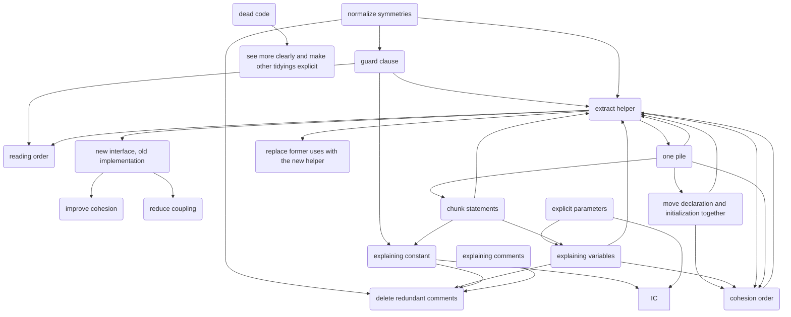

```mermaid
graph TD;
  GC(guard clause)-->EH(extract helper) & EC(explaining constant) & RO(reading order);
  DC(dead code)-->ZS(see more clearly and make other tidyings explicit);
  NS(normalize symmetries)-->GC & EH & DRC(delete redundant comments);
  NIOI(new interface, old implementation)-->ZIC(improve cohesion) & RC(reduce coupling);
  CO(cohesion order)-->EH;
  MDIT(move declaration and initialization together)-->EH & CO;
  EV(explaining variables)-->DRC & EH & CO;
  EC-->DRC & IC;
  EP(explicit parameters)-->EV & IC;
  CS(chunk statements)-->EH & EV & EC;
  EH-->RO & OP(one pile) & CO & NIOI & ZRFU(replace former uses with the new helper);
  OP--> CS & CO & EH & MDIT;
  ECO(explaining comments)-->DRC;
```
